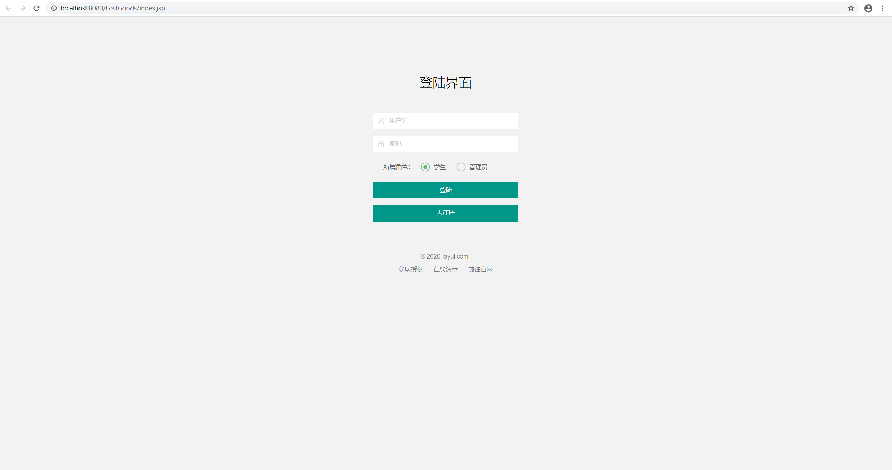
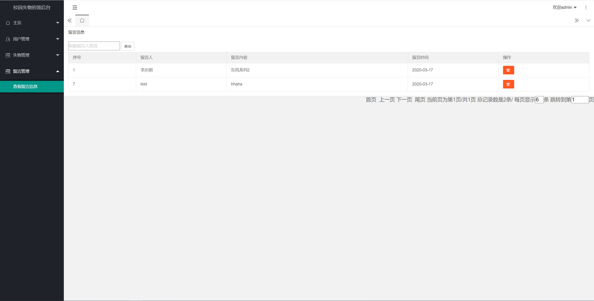
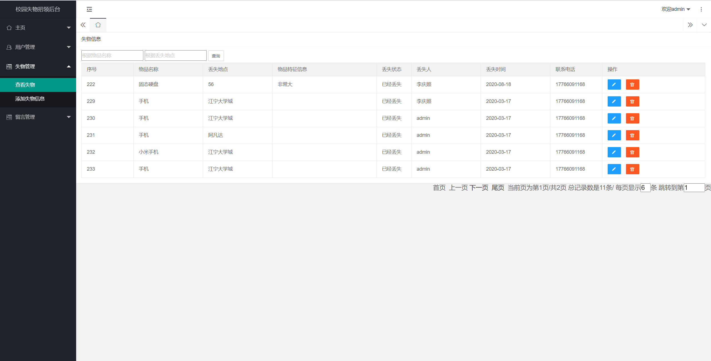
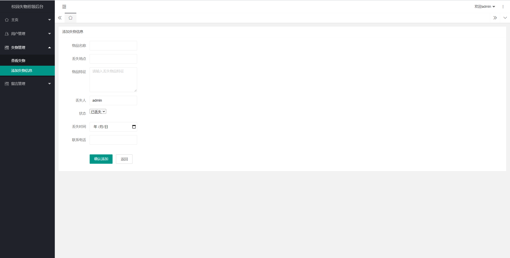
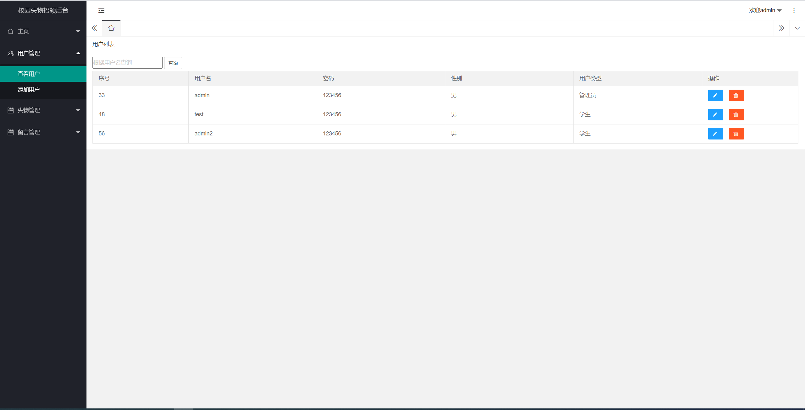
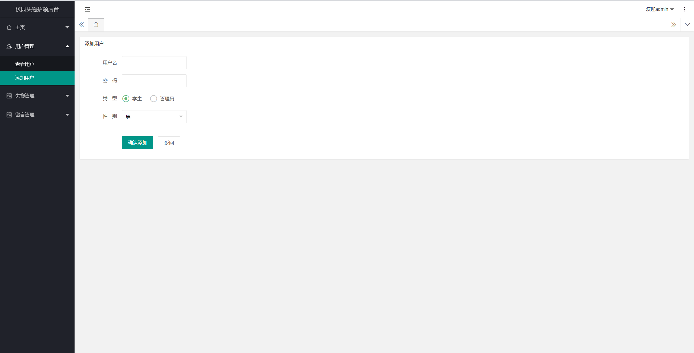
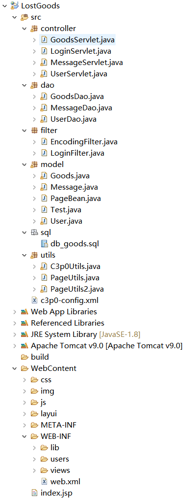

<h1 align="center">基于JSP+Servlet实现的校园失物招领系统</h1>

<h4> 完整代码获取地址：从戎源码网（https://armycodes.com/） </h4>
<h4> 作者微信：19941326836 QQ：605739993 QQ群：655392706 </h4>
<h4> 承接计算机毕设、Java毕业设计、Python毕业设计、深度学习、机器学习 </h4>
<h4> 选题+开题报告+任务书+程序定制+安装调试+论文+答辩ppt 一条龙服务 </h4>
<h4> 毕业设计所有选题地址：(https://github.com/Descartes007/allProject) </h4>

## 项目介绍

基于JSP+Servlet实现的校园失物招领系统：前端 JSP、BootStrap、JQuery、Ajax，后端 Servlet，系统角色分为：管理员和学生。管理员在管理端对系统用户进行管理，可以查看失物发布情况、留言信息等；失主可以对发布挂失信息、留言等。主要功能如下：

### 管理员
- 基本操作：登录、注册、修改密码、修改个人信息、登出
- 用户管理：筛选用户信息、添加用户信息、获取用户信息列表、查看用户信息详情
- 失物管理：筛选失物信息、发布失物信息、获取失物信息列表、查看失物信息详情
- 留言管理：筛选留言信息、获取留言信息列表、查看留言信息详情

### 学生
- 基本操作：登录、注册、修改密码、修改个人信息、登出
- 用户管理：筛选用户信息、添加用户信息、获取用户信息列表、查看用户信息详情
- 失物模块：获取失物信息列表、查看失物信息详情、挂失
- 留言管理：获取留言信息列表、查看留言信息详情、留言、修改留言内容、删除留言、查看我的留言

## 环境

- <b>IntelliJ IDEA 2020.3</b>

- <b>Mysql 5.7.26</b>

- <b>Tomcat 9.0.41</b>

- <b>JDK 1.8</b>

## 运行截图

