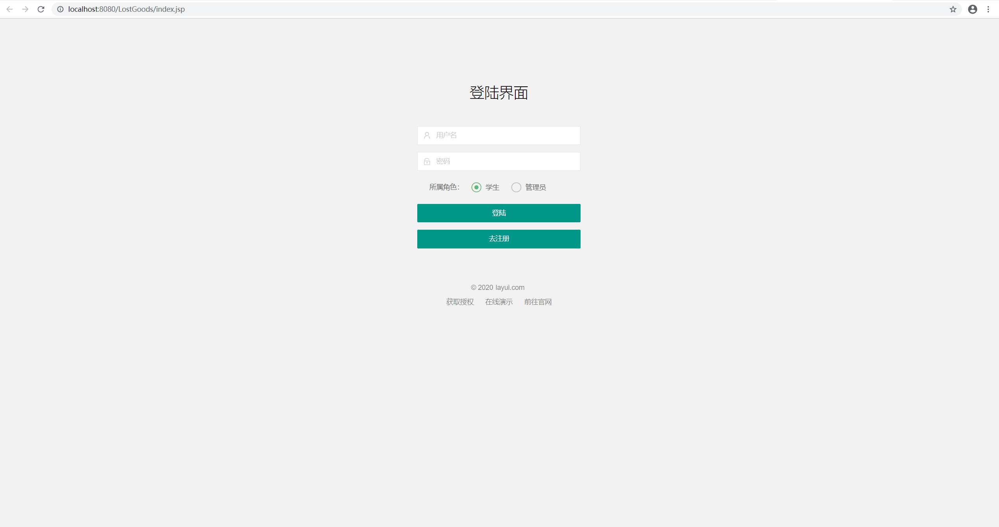
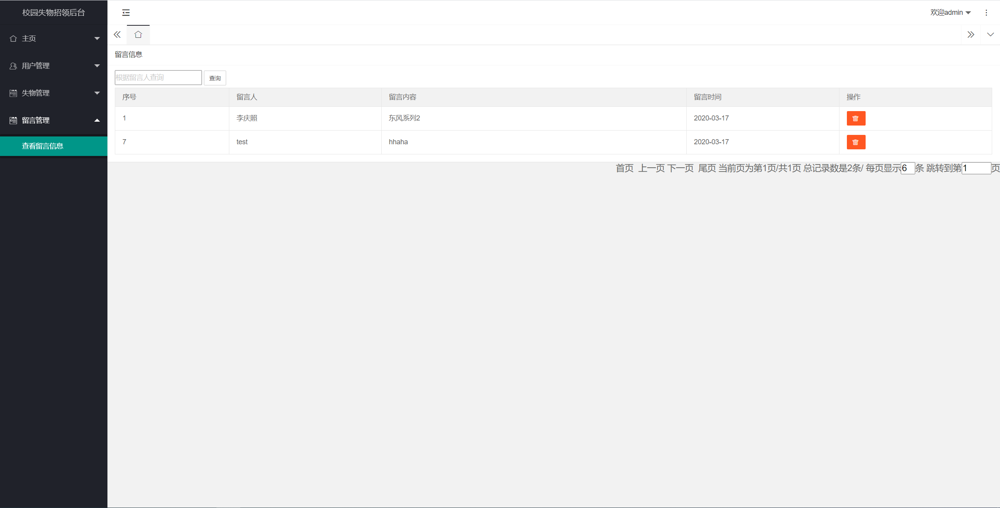
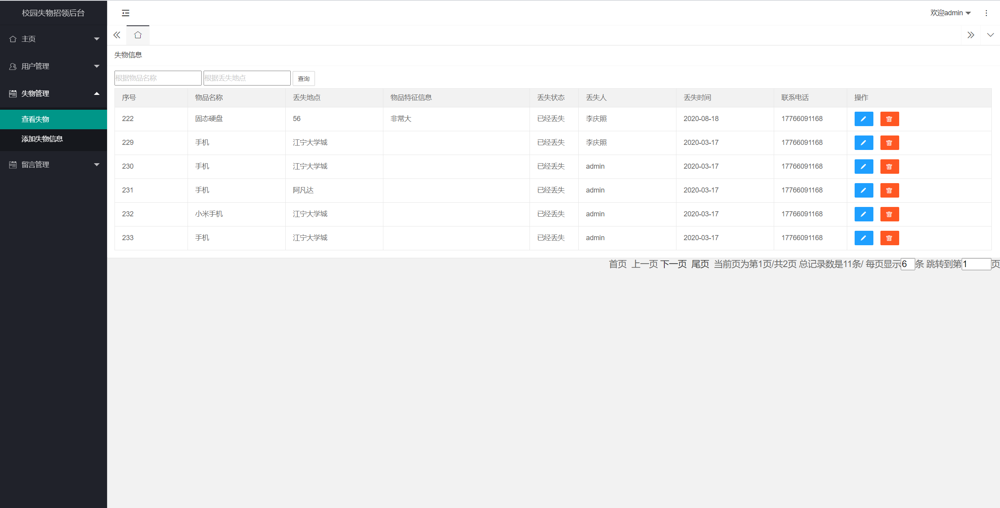
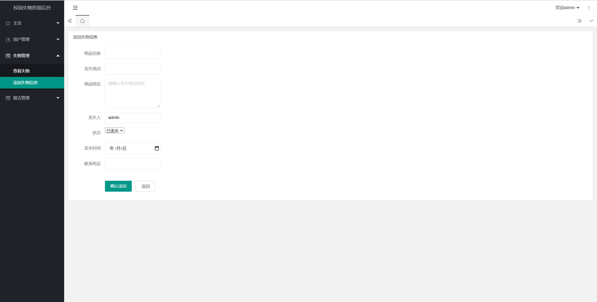
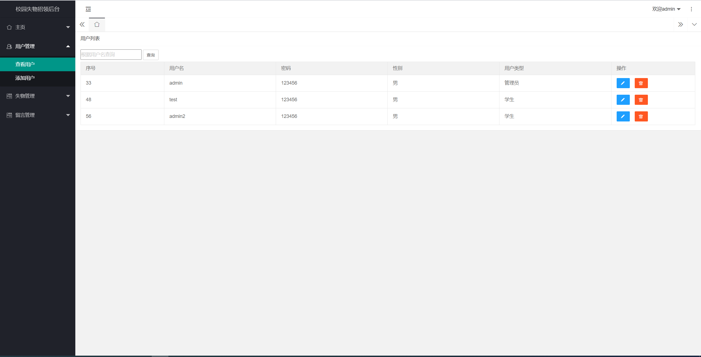
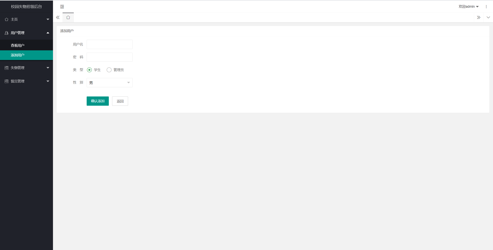
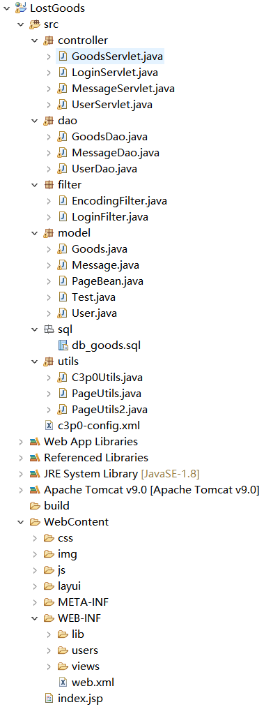

<h1 align="center">基于JSP+Servlet实现的校园失物招领系统</h1>

 获取sql文件 QQ: 605739993 QQ群: 377586148 

 [源码获取网站: 从戎源码网](https://armycodes.com/)

## 简介

> 本代码来源于网络,仅供学习参考使用!
>
> 提供1.远程部署/2.修改代码/3.设计文档指导/4.框架代码讲解等服务
>
> 管理员登录地址：http://localhost:8080/photoalbum/admin/
>
> 管理员: admin 密码: 123456
>
> 用户登录地址：http://localhost:8080/photoalbum/
> 
> 用户：test 密码: 123456

## 项目介绍

基于JSP+Servlet实现的校园失物招领系统，主要功能如下
**【学生角色】**
主页：控制台
用户管理：个人信息，修改密码
失物管理：查看失物信息，我的失物信息，我要挂失
留言管理：留言板，我的留言，我要留言

**【管理员角色】**
主页：控制台
用户管理：查看用户，添加用户；
失物管理：查看失物，添加失物信息；
留言管理：查看留言信息

## 环境

- <b>IntelliJ IDEA 2020.3</b>

- <b>Mysql 5.7.26</b>

- <b>Tomcat 8.0.32</b>

- <b>JDK 1.8</b>

## 运行截图

